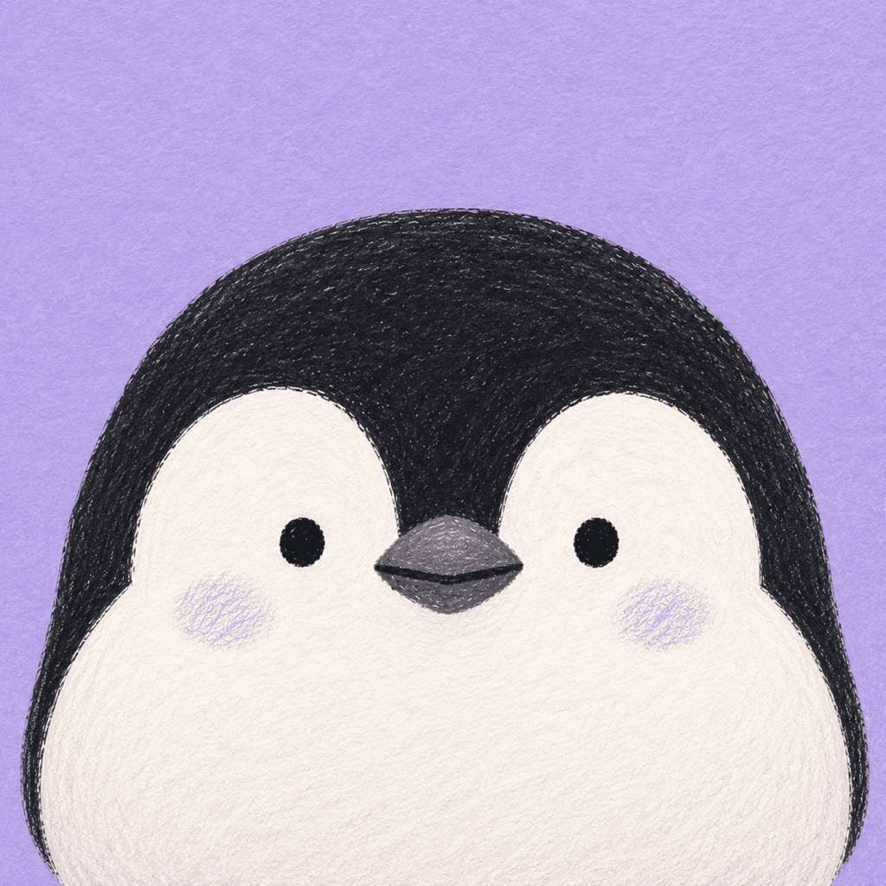
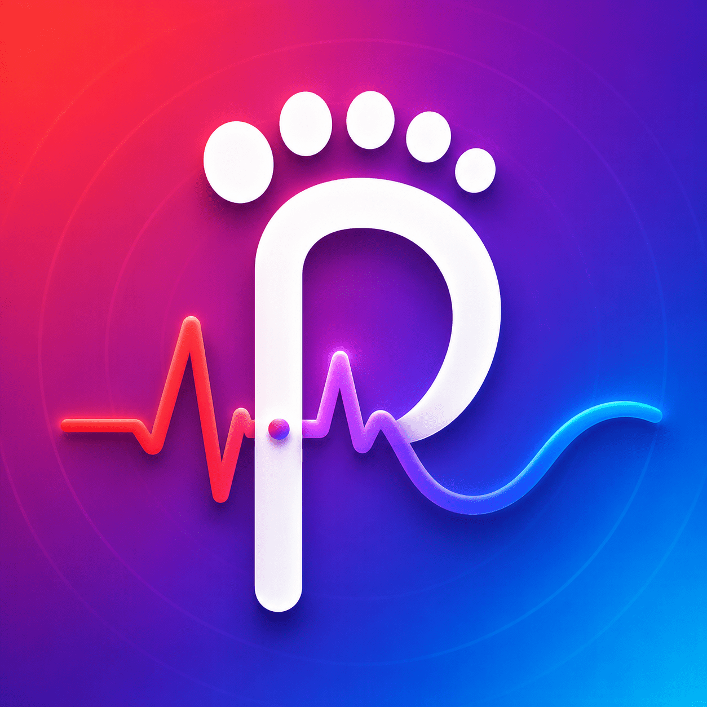
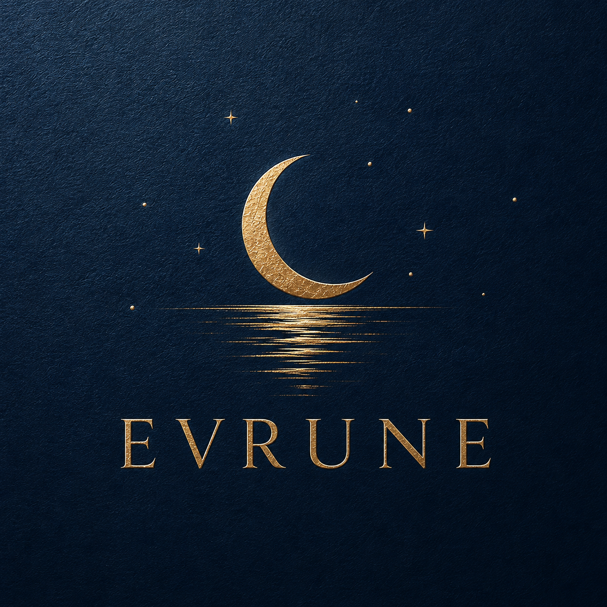
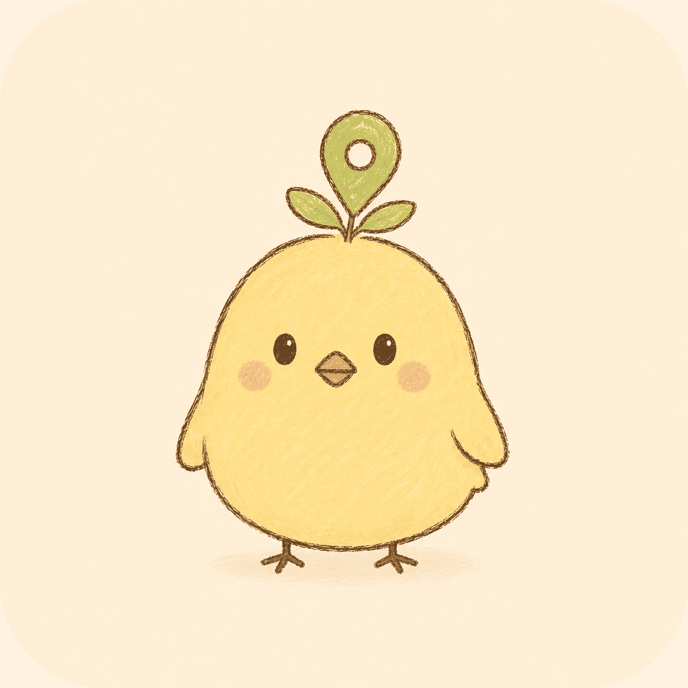
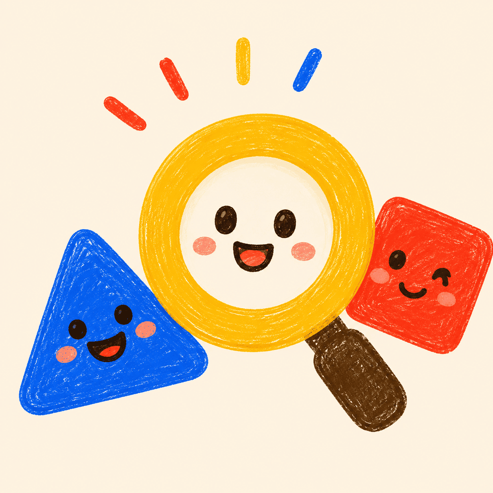
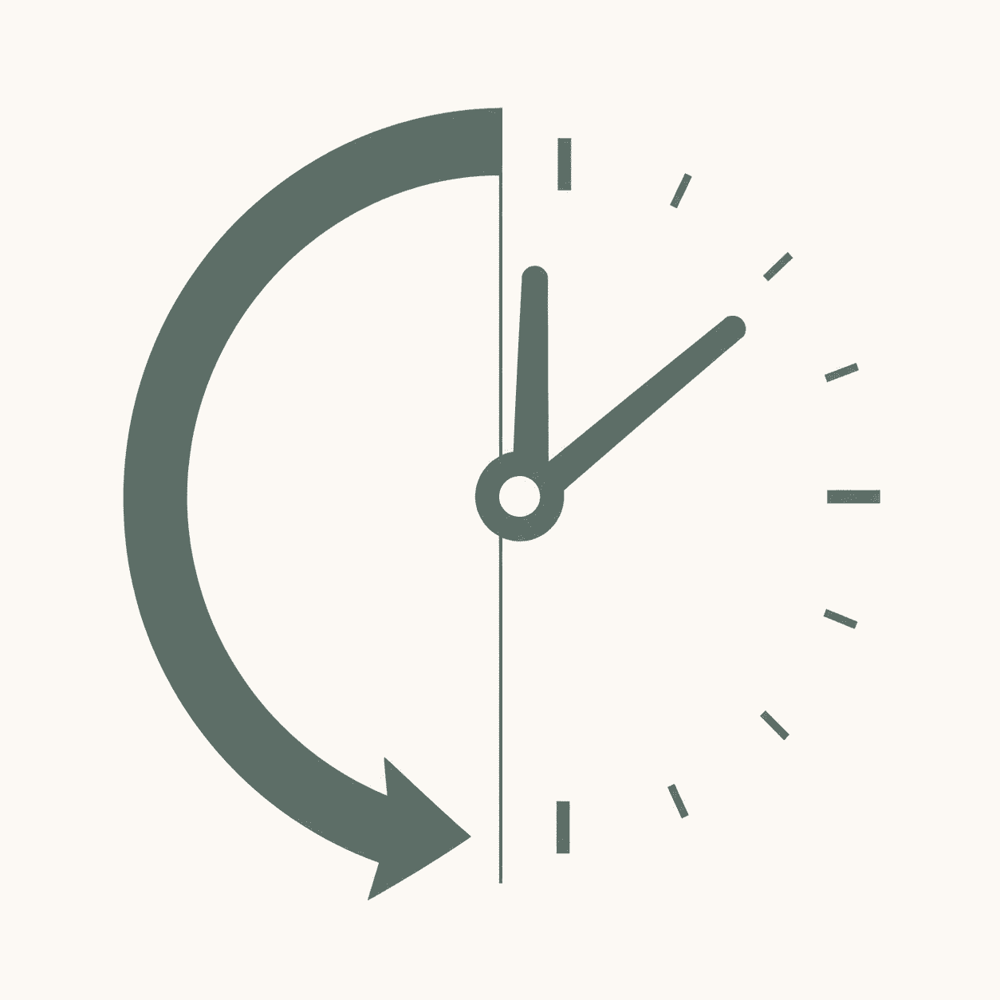
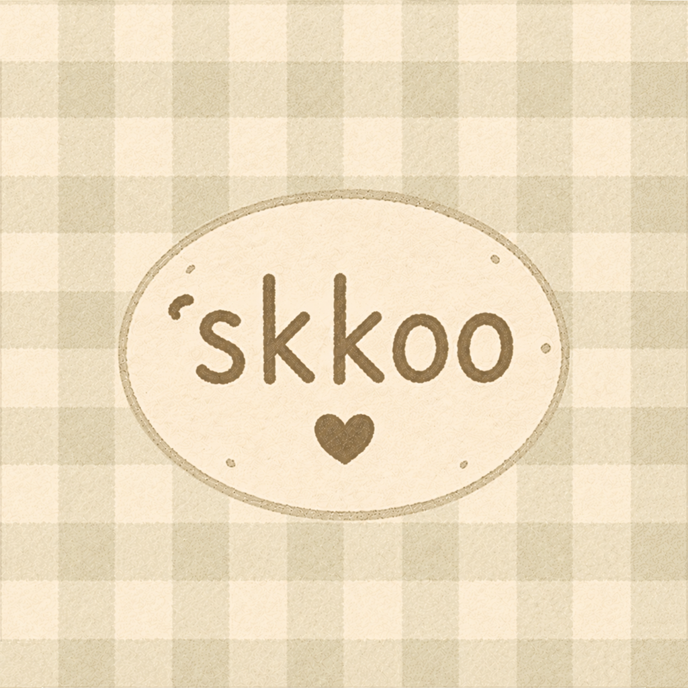

<!-- Top animation only -->

<!-- Animated Tech Icons -->

 
<!-- Static projects heading -->
<h2>📱 PROJECT</h2>

  
  
  
  
  
  

 

<table>
<tr>
<td align="center" valign="top" width="145">

 
<strong>Mapary</strong>
 

 

&nbsp;

</td>

<td align="center" valign="top" width="145">

 
<strong>Runtronome</strong>
 

 

&nbsp;

</td>

<td align="center" valign="top" width="145">

 
<strong>ODOW</strong>
 

 

</td>

<td align="center" valign="top" width="145">

 
<strong>LOCAUNT</strong>
 

 

</td>
</tr>

<tr>
<td align="center" valign="top" width="145">

 
<strong>PepeSnap</strong>
 

 

</td>

<td align="center" valign="top" width="145">

 
<strong>Waesseum</strong>
 

 

</td>

<td align="center" valign="top" width="145">

 
<strong>Tocklist</strong>
 

 

</td>

<td align="center" valign="top" width="145">

 
<strong>TeruBozu</strong>
 

 

</td>
</tr>

<tr>
<td align="center" valign="top" width="145">

 
<strong>SKKOO</strong>
 

 

</td>

<td align="center" valign="top" width="145">

 
<strong>Feeloo</strong>
 

 

</td>

<td align="center" valign="top" width="145"></td>
<td align="center" valign="top" width="145"></td>
</tr>
</table>

<!-- Static contact heading -->
<h2>📫 CONTACT</h2>

  Visit SAME STUDIO or send me an email.

